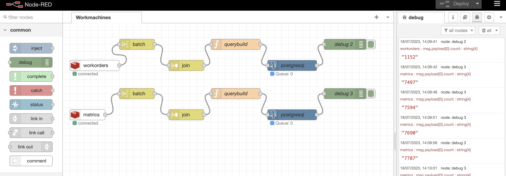

# Data Engineer Challenge

How you implement the challenge is up to you. The only requirements are that the code must run with minimal setup on our own machines and that the code is clean and well abstracted.

1. Write two APIs that are going to stream the data (use the data in the provided files as the source.  The first stream named 'metrics.json' is an example of machine data. The second, 'workorder.json', defines what product ran when and how much output was produced ). A cousmer/producer should be implemented to consume from the API and then publish to a message broker system. Another cousmer should be implemented to presist the data from the message broker.

2. Create an ETL pipeline that reads the data from step 1, and finds the top three parameters that correlate to the production output of each product (please note that there is a relation between the metrics and the workorders data), and output them in a static report.

Document any design considerations and how to run your code.
You may use the provided files to test but your entire system will be tested on a different set of files.

## Description of the Solution

I've' developed a solution using Docker Compose YAML from Airflow to create the entire infrastructure. In the Compose file, I made several adjustments:

- I configured port mapping for Redis and Postgres services to allow access to these services outside the Docker network.
- Additionally, I integrated Node-RED as a service into the setup.
- I created two separate services for each API to streamline data streaming.

### Why I Chose Node-RED?

I opted for Node-RED because of its user-friendly interface and its alignment with the specific use case of gathering data from devices, especially IoT devices. Node-RED simplifies the process and makes it well-suited for our requirements.

### Why I Chose Redis Pub/Sub as the Message Broker?

There were a couple of reasons behind choosing Redis Pub/Sub as our message broker. Firstly, Redis was already included in the Docker Compose project, making it a convenient choice. Additionally, Redis is known for its ease of use and high reliability, which makes it a suitable fit for our needs.

### API Implementations

To handle data streaming and message publishing, I developed a `BaseApi` class. This class retrieves data from the JSON files and sends it to the Redis Pub/Sub broker. To accommodate the specific JSON files, I created two Python files, each extending the `BaseApi` class to handle and publish data from the respective JSON file.

### Node-RED Implementation

The Node-RED implementation involves a single flow containing two subflows, both serving the same purpose. They subscribe to the designated topics, buffer incoming data, and then send the data to Postgres in manageable chunks. This approach ensures we avoid overwhelming the Postgres connection and maintain smoother data handling.

Overall, this solution establishes a robust and user-friendly infrastructure that streams data from the APIs, processes it using Node-RED, and ultimately stores it in Postgres.

## Further improvements
- Create a dedicated user in postgres for the node-red implementation.
- Add a password/secret key for Redis.
- Implement new Redis & Postgres instances, isolated from airflow.

## Folder structure
- airflow: dedicated volume for Airflow
- api: basecode for the APIs
- data: metrics.json & workorder.json folder
- node-red: dedicated volume for node-red
    - flows.json: Flow file that contains the information about the current flow running in node-red
- postgres: Initialization files.

## run the project
Into this repository has a docker-compose.yml to run up easy Airflow.

Run these following commands:

#### Create folder (share with container through volume)
```mkdir -p ./airflow```
```mkdir -p ./airflow/dags ./airflow/logs ./airflow/plugins ./airflow/config```

### Execute the following command
```echo -e "AIRFLOW_UID=$(id -u)" > .env```

#### Initialize the DB, Redis and NodeRed first
```docker-compose up -d init```

#### Initialize the other services
```docker-compose up -d```

## Node Red UI
[Click here](http://localhost:1880)

## Airflow UI
[Click here](http://localhost:1880)

## Airflow DAG
The current dag called `report` use PythonOperator in order to perform a query in postgres using PostgresHook and storing the results in data folder as a csv. This DAG will runs hourly.

## Node-red and APIs
As well as Node-red and the APIs will run automatically after start the docker containers.

## Message Broker (REDIS)
There are two topics:
- workorders
- metrics

#### Caveats
Data could be missing because, if the consumer is not working, those messages that were not handled by any consumer will be lost.

## Node-red
The Node-RED implementation handles every new message in the message broker and gathers a bunch of them to send them to PostgreSQL afterward.


